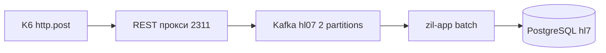

# LAB13 — единое руководство: ТЗ, пошаговый план и реализация

Документ — **единственный полный файл** по LAB13 для вашей выдачи (Трюх Екатерина, топик **`hl07`**, БД **`hl7`**): и **техзадание**, и **раздел §0 «куда подключиться и что набрать»**. Ветка документации **`LAB13_PLAN_RU.md`** содержит только ссылку сюда.

Документ задаёт **полное техническое задание и пошаговую реализацию** лабораторной LAB13 на базе стенда LAB12: нагрузочное тестирование с **переносом операций записи в Kafka**, переходом консьюмера на [**batch listener**](https://docs.spring.io/spring-kafka/reference/kafka/receiving-messages/listener-annotation.html#batch-listeners), сбором **графиков** для сочетаний **CPU 0.5 / 1.0** (одинаково для **`app`** и **`additional`**) и **`@KafkaListener(concurrency)` = 1 и 2** при **ровно двух партициях** топика.

**Выбранный и единственный для этой дорожки способ:** **прокси + HTTP из k6** — маленький сервис принимает **`POST /publish`** с JSON команд LAB12 и публикует **value** в Kafka; **k6** делает только **`http.post`** на этот сервис. **Расширение xk6-kafka в этой ветке не используется** (см. §2.2.6 краткая справка).

**Где запускать прокси:** **ВМ нагрузки** — SSH через шлюз **2311**, внутренний IP узла **`10.60.3.8`** (таблица курса), рядом с **`k6`**: так не нужно пересобирать бинарник k6 и проще отлаживать сеть до брокеров.

Репозиторий курсовой работы в примерах ниже: основной модуль **`zil`** в [Labs_hls](https://github.com/tryuchekaterina/Labs_hls) (или актуальная ссылка из вашей строки Google Sheet).

### Оглавление (дорожка «прокси»)

| § | Раздел |
|---|--------|
| **0** | **Пошаговый план** — куда SSH, что экспортировать, **4 прогона** матрицы, curl и k6 |
| 1 | Выдача, ВМ, топик |
| 2.2 | **Прокси + k6** — архитектура, REST, env, запуск на **2311**, сценарий k6 |
| 2.3 | Batch `@KafkaListener` |
| 2.4–2.6 | Партиции **2**, CPU **0.5/1.0**, матрица и графики |
| 3–5 | Предусловия, чеклист кода, порядок прогонов |
| 6–8 | Артефакты сдачи, типичные проблемы, ссылки |

**Пароли, логины админок и строки подключения из таблицы курса не копируются в git** — используйте только выданную таблицу и локальные env-файлы.

---

## 0. Полный пошаговый план: куда подключаться и что вводить

Этот раздел — **практическая дорожка** с вашими хостами и именами (**hl07**, **hl7**, **2307**, **2311**). Обоснования и детали контракта — в §2 и далее.

### 0.0. Зачем это делаем (одной таблицей)

| Было в ранних лабах | Нужно в LAB13 |
|---------------------|---------------|
| k6 шлёт мутации **напрямую** в **app** / **8083** по REST | «Запись» нагрузки идёт в **Kafka** (топик **`hl07`**), **app** только **читает** топик |
| Сообщения по одному в listener | **Batch**-listener + измерения при **concurrency 1 и 2** |
| Один уровень CPU | Матрица **CPU 0.5 и 1.0** (одинаково **app** + **additional**) × **concurrency 1 и 2** при **ровно 2 партициях** |

**Цепочка данных:** **k6** (ВМ **2311**) → **HTTP POST** → **прокси** (тоже **2311**) → **Kafka** → **zil-app** (Docker на ВМ **2307**) → **PostgreSQL** (схема/БД **`hl7`**).

### 0.1. Ваши постоянные данные (подставляйте в команды)

| Что | Значение |
|-----|----------|
| ФИО | Трюх Екатерина |
| Репозиторий | `https://github.com/tryuchekaterina/Labs_hls` — клонируйте **свой** URL из таблицы |
| SSH **приложения / Docker (`zil`)** | `ssh -p 2307 hl@hlssh.zil.digital` |
| SSH **нагрузка / k6** | `ssh -p 2311 hl@hlssh.zil.digital` |
| SSH **Kafka-1** (CLI, как в LAB11) | `ssh -p 2314 hl@hlssh.zil.digital` (при необходимости **2315**) |
| Топик Kafka | **`hl07`** |
| Имя БД в задании | **`hl7`** |
| Внутренний IP ВМ k6 | **`10.60.3.8`** |
| Брокеры по IP, если DNS не работает | **`10.60.3.12:9094,10.60.3.13:9094`** (kafka-1 / kafka-2) |
| Порт прокси (пример) | **`18080`** — можно другой; тогда везде поменяйте URL и `PROXY_URL` |

**Пароль** для `hl@hlssh.zil.digital` — только из вашей строки Google Sheet, **не** в git.

### 0.2. Git: ветка и фиксация работы

На машине, где лежит клон (ваш ПК или **2307**):

```bash
cd ~/work/Labs_hls
git fetch origin && git checkout docs/lab12-kafka-consumer && git pull --ff-only
git checkout -b docs/lab13-kafka-batch-load-testing
```

После изменений:

```bash
git add zil/
git status
git commit -m "docs(lab13): …" 
# или git commit -m "feat(lab13): batch listener, kafka-proxy, k6 scenario"
```

### 0.3. Что **надо написать в коде** до полноценной сдачи

Пока пункты не готовы — шаги **0.5–0.8** являются проверкой «как должно быть»; **curl** и **k6** не сработают, пока нет рабочего прокси и файла сценария k6.

Краткая таблица со ссылками на теорию ниже по документу:

| № | Что сделать | Где подробнее в этом файле |
|---|-------------|----------------------------|
| 1 | **Batch listener** в Spring Kafka | §2.3, §4.1 |
| 2 | **Concurrency** через env **`KAFKA_LISTENER_CONCURRENCY`** (**1** или **2**) | §4.2, §5 |
| 3 | Каталог **`zil/lab13-kafka-proxy/`**: **POST `/publish`** → **Kafka Producer** в **`hl07`** | §2.2, §2.2.7, §4.4 |
| 4 | Файл **`zil/k6/load-lab13-kafka-proxy.js`** и переменная окружения **`PROXY_URL`** | §2.2.5, §4.5 |

#### 0.3.1. Простыми словами (это не «шифры», а конкретные задачи в репозитории)

**Пункт 1 — Batch listener.** Сейчас Spring, скорее всего, отдаёт в ваш слушатель **одно сообщение** за раз. Нужно переключить консьюмера на режим **партии**: за один раз приходит **`List<String>`** (или список записей), вы в цикле для каждой строки вызываете **ту же логику**, что и в LAB12 (**`KafkaRentalCommandRouter`**). Правите Java в **`zil`**: конфигурация фабрики Kafka + метод с **`@KafkaListener`** — см. §2.3 и файлы из §4.1.

**Пункт 2 — `KAFKA_LISTENER_CONCURRENCY`.** Это **имя переменной окружения** в Docker (не пароль). Оно должно попадать в **`app`** и в код превращаться в **`app.kafka.listener.concurrency`**. Значение **1** или **2** вы задаёте **на ВМ 2307** перед `docker compose up` (как в **0.4**), чтобы для отчёта прогнать **две** конфигурации параллельности при **двух партициях** топика. Где прописать переменную в compose — §4.2.

**Пункт 3 — каталог `lab13-kafka-proxy`.** Отдельная маленькая программа **не внутри Spring-приложения**: она крутится на **ВМ 2311**, слушает **HTTP** (например `http://127.0.0.1:18080/publish`), принимает **JSON** как в LAB12 и **сама** является **Kafka Producer** (публикует в топик **`hl07`**). В репозитории — папка с кодом, `requirements.txt` или Dockerfile, **`README`** «как запустить». Детали контракта **POST** и пример Compose — §2.2 и §2.2.7.

**Пункт 4 — `load-lab13-kafka-proxy.js` и `PROXY_URL`.**

- **`load-lab13-kafka-proxy.js`** — это обычный **текстовый файл сценария** для программы **k6** (язык похож на JavaScript). Вы **создаёте** его в репозитории рядом с другими сценариями в **`zil/k6/`**. Внутри: в цикле нагрузки собрать JSON команды LAB12 и вызвать **`http.post(…)`** — не в **8083**, а по адресу, который читаете из переменной окружения.
- **`PROXY_URL`** — не аббревиатура-код, а **полный URL эндпоинта прокси**, который вы сами заранее согласовали (путь **`/publish`**, порт **`18080`** или другой). Примеры:
  - `export PROXY_URL="http://127.0.0.1:18080/publish"` — k6 и прокси на **одной** машине **2311**;
  - если бы прокси слушал другой путь, было бы, например, `http://127.0.0.1:18080/api/kafka/publish` — тогда **везде** (curl, k6, README) один и тот же URL.

Перед запуском k6 в шелле на **2311** вы **экспортируете** `PROXY_URL`, затем: `k6 run load-lab13-kafka-proxy.js`. Скрипт k6 **читает** `__ENV.PROXY_URL` (или аналог в k6) и подставляет в **`http.post`**. Без этого k6 не знает, куда слать нагрузку.

**Итог по цепочке для пункта 4:** вы **пишете** файл сценария → **запускаете** прокси → в том же сеансе на **2311** задаёте **`export PROXY_URL=...`** → **`k6 run …`**. Подробности полей JSON и опциональный GET к **8084** — §4.3 и §4.5.

### 0.4. ВМ приложений (**2307**): поднять **app** + **additional**

1. Подключение:

   ```bash
   ssh -p 2307 hl@hlssh.zil.digital
   ```

2. Перейти в модуль (путь поправьте под свой home, если клон не `~/work`):

   ```bash
   cd ~/work/Labs_hls/zil
   git switch docs/lab13-kafka-batch-load-testing
   ```

3. После изменений Java-кода пересоберите образ **app** (пример тега):

   ```bash
   docker compose build app
   export ZIL_APP_IMAGE=rental/zil-app:lab13-local
   ```

4. Перед **каждой** ячейкой матрицы задайте **одинаковые** CPU для **app** и **additional** и нужный **concurrency**:

   ```bash
   export APP_CPUS=0.5 ADDITIONAL_CPUS=0.5
   export KAFKA_LISTENER_CONCURRENCY=1
   ```

5. Поднять контейнеры (**env-файл** тот, что вы используете для **hl7** в курсе — имя может отличаться):

   ```bash
   docker compose --env-file registry-tags-lab8-hl7.env up -d --force-recreate app additional
   ```

   Проверьте, что в конфиге приложения топик **`hl07`** и БД **`hl7`** совпадают с выдачей (как в LAB12).

6. Прогрев и быстрый health:

   ```bash
   sleep 45
   curl -sS -o /dev/null -w "app %{http_code}\n" http://127.0.0.1:8083/stats
   curl -sS -o /dev/null -w "additional %{http_code}\n" http://127.0.0.1:8084/additional/stats
   ```

### 0.5. У топика **hl07** должно быть **2 партиции**

```bash
ssh -p 2314 hl@hlssh.zil.digital
cd ~/kafka_2.13-*   # как у вас в LAB11; имя каталога может отличаться
bin/kafka-topics.sh --describe --topic hl07 --bootstrap-server hl15.zil:9094
```

Если с этого узла **`hl15.zil`** не отвечает, замените bootstrap на **`10.60.3.12:9094`** (или по указанию преподавателя).

Увеличить до **2** партиций (если было **1**):

```bash
bin/kafka-topics.sh --alter --topic hl07 --partitions 2 --bootstrap-server hl15.zil:9094
```

Если партиций уже **больше двух** — стандартно **уменьшить нельзя**; варианты в §2.4.

### 0.6. ВМ нагрузки (**2311**): окружение и запуск прокси

```bash
ssh -p 2311 hl@hlssh.zil.digital
```

Экспорт (строка bootstrap должна **реально работать с 2311**):

```bash
export KAFKA_BOOTSTRAP_SERVERS="hl15.zil:9094,hl14.zil:9094"
# при необходимости:
# export KAFKA_BOOTSTRAP_SERVERS="10.60.3.12:9094,10.60.3.13:9094"

export KAFKA_TOPIC=hl07
export PROXY_URL="http://127.0.0.1:18080/publish"
```

Запуск прокси выполняйте **по `README`** внутри вашего **`zil/lab13-kafka-proxy/`**. Черновик ручного сценария (команды старта HTTP-сервера — из вашего кода/README):

```bash
cd ~/work/Labs_hls/zil/lab13-kafka-proxy
python3 -m venv .venv
source .venv/bin/activate
pip install -r requirements.txt
# пример дальнейшего: uvicorn main:app --host 127.0.0.1 --port 18080
# или: docker compose up -d
```

Прокси должен слушать **127.0.0.1** и тот же порт, что в **`PROXY_URL`**.

### 0.7. Контроль без k6: **curl** с **2311**

```bash
curl -sS -X POST http://127.0.0.1:18080/publish \
  -H 'Content-Type: application/json' \
  -d '{"entity":"USER","operation":"POST","payload":{"fullName":"curl-check","driverLicense":"CRL-001","phone":"+70000000001"}}'
```

Ожидается **HTTP 200**. На **2307** проверка логов:

```bash
docker compose logs -f app
```

Должна быть видимая обработка Kafka-команды (например **`Kafka command`**).

### 0.8. **k6** на **2311** и **четыре** прогона матрицы

На **2311**:

```bash
cd ~/work/Labs_hls/zil/k6
mkdir -p reports-lab13
export PROXY_URL="http://127.0.0.1:18080/publish"
k6 run --summary-export reports-lab13/summary_CPU05_conc1.json load-lab13-kafka-proxy.js
```

**На 2307** перед каждым таким запуском вы уже выставили **`APP_CPUS`**, **`ADDITIONAL_CPUS`**, **`KAFKA_LISTENER_CONCURRENCY`** и сделали **`compose up`** + паузу прогрева (как в **0.4**).

| № | На **2307** (`export` перед `docker compose up`) | Имя `summary` (пример) |
|---|--------------------------------------------------|-------------------------|
| 1 | `APP_CPUS=0.5` `ADDITIONAL_CPUS=0.5` `KAFKA_LISTENER_CONCURRENCY=1` | `summary_CPU05_conc1.json` |
| 2 | `APP_CPUS=0.5` `ADDITIONAL_CPUS=0.5` `KAFKA_LISTENER_CONCURRENCY=2` | `summary_CPU05_conc2.json` |
| 3 | `APP_CPUS=1.0` `ADDITIONAL_CPUS=1.0` `KAFKA_LISTENER_CONCURRENCY=1` | `summary_CPU10_conc1.json` |
| 4 | `APP_CPUS=1.0` `ADDITIONAL_CPUS=1.0` `KAFKA_LISTENER_CONCURRENCY=2` | `summary_CPU10_conc2.json` |

Графики стройте из этих JSON (например **`plot_lab8_reports.py`**, см. §2.6).

### 0.9. Схема для отчёта



---

## 1. Студентка и выдача из таблицы курса — **Трюх Екатерина**

| Поле | Значение для вас |
|------|------------------|
| **ФИО** | Трюх Екатерина |
| **SSH на рабочую ВМ приложений (Docker / `zil`)** | `ssh -p 2307 hl@hlssh.zil.digital` |
| **Kafka Topic** | **`hl07`** (сверить с колонкой **Kafka Topic** в Google Sheet) |
| **База данных (DB name)** | **`hl7`** (согласование с `DBNAME` / схема `hl7` в `registry-tags-*.env`) |
| **Основной репозиторий** | По таблице: `https://github.com/tryuchekaterina/Labs_hls` — клонируйте именно свой URL; дерево модулей в задании — папка **`zil`**. |

**Инфраструктура курса (ориентир по общей таблице):**

| Роль | SSH-порт (шлюз) | Internal IP |
|------|-----------------|-------------|
| **k6** (нагрузка) | **2311** | `10.60.3.8` |
| **DB** (PostgreSQL) | **2312** | `10.60.3.9` |
| **Harbor** | **2313** | `10.60.3.11` |
| **Kafka-1** | **2314** | `10.60.3.12` |
| **Kafka-2** | **2315** | `10.60.3.13` |

**DNS курсовой подсети:** `10.60.1.1`; рабочая сеть узлов **`10.60.3.0/24`**. Для приложения на **`hl07`** имена **`hl14.zil`**, **`hl15.zil`** и топик **`hl07`** уже использовались в LAB11–LAB12; при недоступности DNS из Docker см. **`extra_hosts`** в `zil/docker-compose.yml` из ветки LAB12.

---

## 2. Формулировка LAB13 из программы курса (что нужно доказать)

### 2.1. Нагрузка на стенд LAB12

- Стенд: **`app`** (8083), **`additional`** (8084), удалённая **PostgreSQL**, **Kafka** из LAB11, consumer из LAB12.
- LAB13 **не заменяет** LAB12, а **расширяет** его сценарием измерений и кодом (**batch**, **матрица**).

### 2.2. Изменить нагрузочный профиль **k6** — **прокси + HTTP** (выбранный вариант)

**Было (типично LAB8–LAB10):** k6 отправляет HTTP-запросы в **`app`** или **`additional`** (в т.ч. «операции записи» через REST).

**Нужно в LAB13:** **операции записи нагрузки** должны идти **в Kafka**, а не в основное приложение напрямую по HTTP мутаций.

**Итог по выбранному варианту «прокси + HTTP из k6» (для отчёта):** маленький **отдельный модуль/сервис** в репозитории (**`zil/lab13-kafka-proxy/`** — каталог добавляется при реализации), реализация на **Python**, **Java/Spring Boot** или сочетание с **Docker Compose** по вашему выбору; снаружи — **REST `POST`** (**`/publish`** и т.п.), внутри — **Kafka Producer** в топик эксперимента (**`hl07`**); **k6** делает только **`http.post`** на URL этого сервиса. Удобно поднимать сервис на **ВМ нагрузки** (SSH шлюз **2311**, IP **`10.60.3.8`**) **рядом с уже установленным k6** — без сборки расширяемого k6.

#### 2.2.1. Архитектура канала записи

1. **`k6`** (на **ВМ нагрузки**, SSH через шлюз **2311**, IP узла **`10.60.3.8`** в таблице курса) в цикле сценария делает **`http.post`** на **локальный или внутрикурсовый** URL прокси, например `http://127.0.0.1:18080/publish` (порт возьмите свободный на этой ВМ и зафиксируйте в отчёте).
2. **Прокси** — маленький процесс (**Python + FastAPI/Flask + `kafka-python`**, или минимальный **Spring Boot** с **`KafkaTemplate`**) принимает **JSON** и публикует его **value** в топик (**`hl07`**) через **Kafka Producer**.
3. **`zil-app`** (**2307**) по-прежнему **консьюмит** тот же топик и применяет команды LAB12 (**`KafkaRentalCommandRouter`**).

**Важно для отчёта:** метрики **HTTP** в **k6** измеряют успех/латентность **до прокси** (до подтверждения отправки в Kafka клиентом). Это узкое место «прокси + сеть до брокеров». Упомяните это в тексте («что именно мы мерили»).

**Нельзя** подменять условие «нагрузка записи через Kafka» сценарием вида только **`http.post` напрямую в `app`/8083** на CRUD-эндпоинты — запись мутаций в этом лабораторном смысле должна попадать **в топик** (после **`http.post`** в **прокси**).

#### Дорожная карта именно этого варианта (что где делаешь по порядку)

| Шаг | Где | Действие |
|-----|-----|----------|
| 1 | **2307** | Стенд **`app`** + **`additional`**, топик **`hl07`**, consumer с **batch** (после кода LAB13); пересборка образа **`app`** при необходимости. |
| 2 | На узле **Kafka** (2314/2315 или CLI из LAB11) | Убедиться, что у топика эксперимента **`PartitionCount = 2`** (см. §2.4). |
| 3 | **2311** (`10.60.3.8`) | Поднять **REST‑прокси** (venv + код из **`zil/lab13-kafka-proxy/`** когда появится, или временный скрипт). Задать **`KAFKA_BOOTSTRAP_SERVERS`** / **`KAFKA_TOPIC`**. Слушать **`127.0.0.1:ВАШ_ПОРТ`**. |
| 4 | **2311** | **`curl`** на **`POST /publish`** — проверить **200**. В логах **`app`** на **2307** — **`Kafka command`**. |
| 5 | **2311** | Запуск **k6** с **`zil/k6/load-lab13-kafka-proxy.js`**, переменная **`PROXY_URL=http://127.0.0.1:ВАШ_ПОРТ/publish`**. |
| 6 | **2307** | Для каждой ячейки матрицы (§2.6): синхронно **`APP_CPUS`/`ADDITIONAL_CPUS`** и **`KAFKA_LISTENER_CONCURRENCY`** → **`compose up`** → прогреть → k6 из шага 5 → сохранить JSON/PDF графики. |

**Не нужно на 2311:** пересборка расширяемого **k6 с xk6-kafka**.

#### 2.2.7. Запуск прокси через Docker Compose только на ВМ нагрузки (рекомендация к репозиторию)

При добавлении каталога **`zil/lab13-kafka-proxy/`** положите туда маленький **`compose.yml`**, который **не затрагивает** основной **`zil/docker-compose.yml`** на **2307**. Принцип:

- один сервис с образом из локального **`Dockerfile`** или **официальный** `python:3.13-slim` + `pip install`;
- проброс только **`127.0.0.1:18080->18080`** (или свой порт);
- **`environment`:** `KAFKA_BOOTSTRAP_SERVERS`, `KAFKA_TOPIC`;
- тома и секретов курсовой в git не кладём — только переменные среды на **2311**.

Пример заготовки (подставьте образ/команду старта из вашего `README` прокси после реализации):

```yaml
# zil/lab13-kafka-proxy/compose.proxy.example.yml — пример имени файла (не использовать как имя секрета курса)
services:
  lab13-publish-proxy:
    build: .
    network_mode: "host"
    environment:
      KAFKA_BOOTSTRAP_SERVERS: "hl15.zil:9094,hl14.zil:9094"
      KAFKA_TOPIC: "hl07"
      PROXY_BIND: "127.0.0.1:18080"
```

При **`network_mode: host`** приложение слушает **на самой ВМ** — удобно для **`curl`/`PROXY_URL`**. Альтернатива: режим **`ports: - "127.0.0.1:18080:18080"`** без `host`-сети.

#### Содержимое приложения‑прокси (что именно считается выполнением ТЗ)

Минимум логики, достаточный для методички:

1. **HTTP-сервер** на выбранном порту (**только локальный интерфейс**, если возможно).
2. **`POST /publish`**: **`Content-Type: application/json`**, тело = **полный объект** LAB12 (как value в топик).
3. **Kafka Producer** (`kafka-python` или **`KafkaProducer` из Java`): **`send(topic, value=utf8_bytes(body))`** с ожиданием ack через **`flush()`**/future (чтобы ошибка брокера отражалась в **5xx** и в **`http_req_failed`** k6).
4. Ответ **`200`** + короткий JSON **`{"status":"ok"}`** при успехе.

Реализации **нет** обязательного требования к Spring Boot здесь — **Python достаточен** для курсовой экономии времени на **2311**.

#### 2.2.2. Контракт REST у прокси (рекомендация под LAB12 JSON)

Единственный нужный метод:

| Поле | Значение |
|------|----------|
| Метод | **`POST`** |
| Path | например **`/publish`** или **`/api/kafka/publish`** (один контракт на весь семестр) |
| **`Content-Type`** | **`application/json`** |
| Body | Полное сообщение LAB12 как в Kafka value: **`{ "entity": "...", "operation": "...", "payload": ... }`** — тот же JSON, который вы слали через `kafka-console-producer` / скрипт `kafka_lab12_publish_sample.py`. |

Ответ успеха: **`200`** + коротко **`{"status":"ok"}`** или пустое тело. Ошибки: **`4xx`** (неверный JSON), **`503`** если брокер недоступен — по желанию, чтобы удобнее читать `http_req_failed` в k6.

**Начинать нужно только с `POST`;** авторизацию для курса можно не включать при условии, что прокси слушает **только локальный интерфейс** (`127.0.0.1`) или внутреннюю подсеть.

#### 2.2.3. Конфигурация прокси через переменные окружения (без секретов в git)

На **ВМ 2311** перед запуском:

| Переменная | Назначение | Пример |
|------------|-----------|--------|
| `KAFKA_BOOTSTRAP_SERVERS` | Брокеры, **достижимые с этой ВМ** | `hl15.zil:9094,hl14.zil:9094` или IP из таблицы |
| `KAFKA_TOPIC` | Топик | `hl07` (или временный топик LAB13 при `PartitionCount`) |
| `PROXY_HTTP_HOST` / `PROXY_HTTP_PORT` | Где слушает прокси | `127.0.0.1` и `18080` |

Если **`hl15.zil`** с **2311** не резолвится или не ходят порты — приведите строку bootstrap к виду **`10.60.3.12:9094,10.60.3.13:9094`** (kafka-1 / kafka-2) **по указанию преподавателя и реальной связности.**

#### 2.2.4. Запуск прокси на ВМ **2311** (порядок «сразу как для сдачи»)

1. **Сеть:** с **2311** до брокеров должен быть открыт **порт вашего клиента Kafka** (часто **9094**) по **`KAFKA_BOOTSTRAP_SERVERS`**. При отсутствии DNS по именам `hl*.zil` временно берите строку bootstrap по **IP** из таблицы курса: **`10.60.3.12:9094,10.60.3.13:9094`** (kafka-1 / kafka-2) — по согласованию с преподавателем.
2. **Переменные окружения** — см. §2.2.3; топик (**`hl07`**) совпадает с тем, из которого читает **`zil-app`** на **2307**.
3. **Слушать только локально:** `127.0.0.1:18080` (или другой порт) — k6 шлёт на **localhost**, наружу прокси не обязательно торчать.

**Режимы запуска:**

- **Вручную:** `python …` (**FastAPI/Flask** + **`kafka-python`**) или `java -jar …` после **`pip install` / сборки**.
- **`docker compose` на 2311:** отдельный **`compose.yaml`** + небольшой **`Dockerfile`** только для прокси (не тянуть сборку всего **`zil`** на машину нагрузки без необходимости).

**Минимальная логика обработчика `POST /publish`** (концептуально): прочитать тело как **сырой JSON-объект** → сериализовать в **строку UTF-8** → **`producer.send(topic, value=bytes)`** → после **`future.get`/acks** вернуть **200**.

**Проверка до k6 (с ВМ 2311, прокси уже запущен):**

```bash
curl -sS -X POST http://127.0.0.1:18080/publish \
  -H 'Content-Type: application/json' \
  -d '{"entity":"USER","operation":"POST","payload":{"fullName":"curl-check","driverLicense":"CRL-001","phone":"+70000000001"}}'
```

Ожидается **HTTP 200**; на **2307** в логах `app` должна появиться строка **`Kafka command`** (после доработки listener под batch — та же семантика обработки).

**Рекомендуемый стек прокси на 2311 (минимум зависимостей):** **Python 3** + **FastAPI** или **Flask** + **`kafka-python`** (как в [kafka_lab12_publish_sample.py](../scripts/kafka_lab12_publish_sample.py): тот же bootstrap/topic). На Debian 13 не ставьте пакеты в системный Python без venv — **`python3 -m venv .venv-proxy`** в каталоге прокси, затем **`pip install fastapi uvicorn kafka-python`** (или эквивалент).

**Структура каталога в репозитории (добавляется при реализации):** `zil/lab13-kafka-proxy/` — `README.md` (bootstrap, топик, порт, типичная ошибка `NoBrokersAvailable`), `requirements.txt`, опционально `Dockerfile` + `compose.yaml` только для прокси; **не** смешивать с полным `docker-compose.yml` приложения на **2307**. Вместе со сценарием **`zil/k6/load-lab13-kafka-proxy.js`** это единое воспроизводимое место для проверки преподавателем.

#### 2.2.5. Изменение **k6**

- Новый файл сценария (например **`zil/k6/load-lab13-kafka-proxy.js`**) заменяет ветку «записи» так: вместо `http.post` в **`8083`** генерируете JSON (случайные поля пользователя через **`uuid`** / **`randomString`** в k6 для уникальных `driverLicense`) и отправляете на **`PROXY_URL`**, например:
  - `export PROXY_URL="http://127.0.0.1:18080/publish"`
- Чтение через **`additional` / 8084** остаётся **опциональной** второй долей как в методичке (см. §4.3).

#### 2.2.6. Справка: xk6-kafka (не используется в вашей реализации)

Расширение **[xk6-kafka](https://github.com/mostafa/xk6-kafka)** позволяло бы слать сообщения в Kafka из k6 без прокси, но требует **сборки кастомного k6**. **В рамках выбранного варианта «прокси + HTTP» не применяйте** — в отчёте достаточно одной строки: «нагрузка записи — HTTP POST на REST-прокси на 2311, публикация в топик **`hl07`**».

### 2.3. Batch Kafka Listener

Переведите консьюмера сообщений LAB12 со **слушателя по одному сообщению** на **batch listener** по официальной документации Spring Kafka:

**Ссылка:** [Batch listeners](https://docs.spring.io/spring-kafka/reference/kafka/receiving-messages/listener-annotation.html#batch-listeners).

**Обязательные следствия в коде `zil`:**

1. Контейнер-фабрика listener’а должна быть в **режиме batch**: у `ConcurrentKafkaListenerContainerFactory` включить поддержку партий сообщений (**`setBatchListener(true)`** — формулировка в коде см. вашу версию Spring Kafka API).
2. Метод с **`@KafkaListener`** принимает **список** записей или **список** значений (`List<String>`, `List<ConsumerRecords<...>>` и т.д. — см. документацию для ваших типов ключ/значение).
3. Внутри метода организуйте цикл по партии и для **каждого** элемента вызывайте ту же доменную логику (**`KafkaRentalCommandRouter` / сервисы**), что и в LAB12, без дублирования бизнес-правил в «сыром» цикле (вынести метод `processOne(String json)` если нужно).
4. **Обработка ошибок:** решите явно для отчёта: при ошибке парсинга одной строки партии — пропуск, DLQ или падение всей партии (согласуйте минимально разумную политику; зафиксируйте в отчёте).

**Цель методички для преподавателя:** продемонстрировать понимание **пакетного приёма** и влияния на производительность/латентность обработки.

### 2.4. `@KafkaListener(concurrency)` и партиции

По условию LAB13 нужно провести измерения при:

- **`concurrency = 1`**
- **`concurrency = 2`**

И при этом топик (**`hl07`**) должен иметь **`PartitionCount = 2`**.

Смысл ограничения:

- При **`concurrency = 2`** в одном процессе **Spring** два потока consumer group могут **параллельно** читать **разные партиции** топика в рамках одной группы.
- Если партиций **меньше**, чем запрошенная параллельность осмысленного масштабирования**, часть потоков простаивает.
- Если партиций **больше 2**, для сравнимости «строго между 1 и 2» имеет смысл **зафиксировать ровно 2** партиции (как указано в ТЗ).

Команды на узле Kafka (или в контейнере CLI из LAB11), после перехода в каталог установки **`kafka_2.13-...`**:

```bash
# Текущее состояние
bin/kafka-topics.sh --describe --topic hl07 --bootstrap-server hl15.zil:9094

# Привести к 2 партициям (если было меньше — increase; если было больше — уменьшить нельзя стандартным alter)
bin/kafka-topics.sh --alter --topic hl07 --partitions 2 --bootstrap-server hl15.zil:9094
```

Если топик уже имел **>2** партиций и методичка курса **требует ровно 2**, возможны варианты: отдельный топик только для LAB13 (например `hl07-lab13-bench`) или согласование с преподавателем — **зафиксируйте в отчёте**, что именно вы сделали.

### 2.5. Лимиты CPU **`app`** и **`additional`**

Нужно **два набора прогонов** по ограничению CPU контейнеров:

| Серия | `APP_CPUS` | `ADDITIONAL_CPUS` |
|-------|------------|-------------------|
| A | **0.5** | **0.5** |
| B | **1.0** | **1.0** |

Указание «**одинаково для основного приложения и additional**» означает: для каждого прогона выставить **совпадающие** лимиты (оба **0.5**, затем оба **1.0**), как уже принято в `docker-compose.yml` через переменные окружения хоста.

Пример перед `compose up`:

```bash
cd ~/work/Labs_hls/zil
export APP_CPUS=0.5 ADDITIONAL_CPUS=0.5
# + образы и env Kafka см. ниже
docker compose --env-file registry-tags-lab8-hl7.env up -d --force-recreate app additional
```

Повтор с **`export APP_CPUS=1.0 ADDITIONAL_CPUS=1.0`** для второй серии графиков.

### 2.6. Матрица экспериментов и графики

Требование к **минимальной** матрице (два независимых параметра):

- **Concurrency listener:** **`1`** и **`2`**
- **CPU (app + additional):** **`0.5`** и **`1.0`**

Итого **4 ключевых сценария** (можно добавить контрольные прогоны с прогревом и повторением по времени как в LAB9–LAB10):

| № | CPU app/add | `app.kafka.listener.concurrency` |
|---|-------------|---------------------------------|
| 1 | 0.5 | 1 |
| 2 | 0.5 | 2 |
| 3 | 1.0 | 1 |
| 4 | 1.0 | 2 |

Для каждого сценария:

1. Зафиксировать **`PartitionCount = 2`** для **`hl07`** (вывод **`kafka-topics --describe`**).
2. Прогреть стенд (после **`up`** выдержите **>= 30–60 с** перед k6 так же, как в прошлых лабораторных).
3. Запустить **k6** со сценарием **`load-lab13-kafka-proxy.js`** (или вашим именем): **`http.post`** на **`PROXY_URL`**, запись в Kafka выполняет прокси (см. §2.2).
4. Сохранить **summary JSON** k6 (`--summary-export` или аналог).
5. Сохранить **логи** `docker compose logs app ...` (и при необходимости **`additional`**), чтобы видеть нагрузку на consumer/Hibernate без утечки секретов.

**Графики** (перечень уточните с преподавателем под шаблон курса, типичный минимум):

- Зависимость **latency (p95/p99)** для **`http_req_duration`** на вызовы **`PROXY_URL`** (или отдельный **Trend** только на POST в прокси), сгруппировать по **CPU × concurrency**. Учтите, что это **не** чистая латентность от консьюмера до БД, а **вход в Kafka через прокси** (для курса приемлемо, если так зафиксировано в отчёте).

Использовать уже знакомые по LAB8–LAB10 утилиты: например **`plot_lab8_reports.py`** в `zil/k6` после приведения имён файлов `--summary-export` к ожидаемым паттернам (или свой скрипт — по согласованию).

---

## 3. Предварительные условия (наследие LAB11–LAB12)

1. Стенд **Kafka** доступен bootstrap-строкой с вашей ВМ **`2307`** (часто `hl15.zil:9094,hl14.zil:9094`).
2. **Consumer** LAB12 уже обрабатывает JSON команд в топик **`hl07`**; для LAB13 вы добавляете **batch** и **переключаемость concurrency** через **properties**/env (**`app.kafka.listener.concurrency`** или отдельный ключ **`LAB13`** — выберите читаемое имя для отчёта).
3. Для сборки образа **`app`** с актуального кода сохранён workflow **`docker compose build app`** + **`ZIL_APP_IMAGE=rental/zil-app:lab12-local`** (или обновите тег LAB13 после рефакторинга).
4. На ВМ **k6** (**2311**) установлен **`k6`**; поднят **REST-прокси** в Kafka с корректным **`KAFKA_BOOTSTRAP_SERVERS`** с этой ВМ.
5. С **ВМ 2311** до брокеров Kafka должен открываться порт **9094** (или тот, что в вашем кластере): иначе прокси зависнет или даст **503** в k6.

---

## 4. Изменения в репозитории `zil` (чеклист разработки)

### 4.1. Batch listener и фабрика

- **`KafkaConsumerConfiguration`**: включить режим партий для нужной **`ConcurrentKafkaListenerContainerFactory`**.
- **`RentalKafkaListener`** (или новый класс): один **`@KafkaListener`** с параметром типа **`List<String>`** (или ваш тип), цикл вызова роутера.
- Сохранить **`concurrency`** в **`${app.kafka.listener.concurrency}`**.
- Протестировать, что сообщения LAB12 (**POST**/**DEL**/смесь) после конвертации в batch ведут себя как раньше (интеграционный способ проверки: Python producer + лог **`Kafka command`**, затем строка в БД).

### 4.2. Свойства

- **`application.properties`**: убедиться, что ключ **`app.kafka.listener.concurrency`** подхватывается на стенде; для Docker задайте переменную окружения **`KAFKA_LISTENER_CONCURRENCY`** в **`docker-compose.yml`** (**у сервиса `app`**), как в LAB12.

### 4.3. Контракт JSON для нагрузки k6

Рекомендуемый профиль сообщений (**запись**):

- Основная доля (**например 80–95%**) — **`USER` + `POST`** с синтетическими полями (`fullName`, `driverLicense`, `phone`), **уникальные значения**, чтобы минимизировать коллизии бизнес-логики (**`uuid`/`randomString` в k6 или в прокси**).
- Небольшая доля (**5–20%**) — **`USER` + `DEL`** с `payload` как UUID существующей записи (**если можете отследить созданные идентификаторы**) — необязательно, если методичке достаточно только POST под нагрузкой; **зафиксируйте** выбранный микс.

**Чтение (опционально):** смесь можно оставить с HTTP на **`additional`** (например availability), чтобы стенд не был «совсем только Kafka» — но **фокус замера** именно на **запись в топик**.

### 4.4. Прокси **REST → Kafka** (реализация на ВМ **2311**)

- Каталог в репозитории: например **`zil/lab13-kafka-proxy/`** — `README` с командами запуска, `requirements.txt` или **Gradle** для минимального Java, опционально **`docker-compose.yml`** только для прокси.
- Логирование: при **`500/503`** логировать причину (например `KafkaTimeoutError`) — облегчает отладку «k6 видит 503».
- Не хранить в git пароли к Kafka; если курс требует PLAINTEXT к брокерам — достаточно bootstrap из внутренней сети.

### 4.5. Скрипт **k6** LAB13 (через прокси)

- Файл **`zil/k6/load-lab13-kafka-proxy.js`**: читает **`PROXY_URL`**, в **`default function`** формирует JSON LAB12 и делает **`http.post`**.
- Опционально смешивать с **`http.get`** на **`BASE_URL` additional** (8084) через **`STATS_SHARE`** по аналогии с [load-lab8-s2s.js](../k6/load-lab8-s2s.js).

---

## 5. Запуск матрицы (пример порядка на **ВМ приложений 2307**)

```bash
cd ~/work/Labs_hls/zil
git switch docs/lab13-kafka-batch-load-testing

# Пример для одной ячейки матрицы: CPU 1.0, concurrency 2 у контейнеров app после пересборки
export APP_CPUS=1.0 ADDITIONAL_CPUS=1.0
export ZIL_APP_IMAGE=rental/zil-app:lab13-local   # ваш тег после сборки
export KAFKA_LISTENER_CONCURRENCY=2               # синхронно с топиком: 2 партиции

docker compose --env-file registry-tags-lab8-hl7.env up -d --force-recreate app additional
sleep 45
curl -sS -o /dev/null -w "app %{http_code}\n" http://127.0.0.1:8083/stats
curl -sS -o /dev/null -w "additional %{http_code}\n" http://127.0.0.1:8084/additional/stats
```

Далее со **стороны ВМ k6** (или вашего скрипта SSH-обёртки, как LAB10-matrix):

```bash
cd ~/work/Labs_hls/zil/k6
mkdir -p reports-lab13
export PROXY_URL=http://127.0.0.1:18080/publish   # адрес прокси на 2311; путь см. ваш README прокси
k6 run --summary-export reports-lab13/summary_cpuXXX_concYYY.json load-lab13-kafka-proxy.js
```

---

## 6. Что приложить к сдаче

| Артефакт | Содержание |
|----------|------------|
| Ветка / PR | Изменения: **batch listener**, **`load-lab13-kafka-proxy.js`**, каталог **`lab13-kafka-proxy/`** (или эквивалент) с **README** |
| `kafka-topics --describe --topic hl07` | **`PartitionCount: 2`**, реплики |
| Вывод конфигурации прогона | CPU 0.5/1.0 для **обоих** контейнеров |
| **`KAFKA_LISTENER_CONCURRENCY`** или эквивалент | **`1`** и **`2`** в разных запусках |
| JSON summaries k6 | Четыре (или более с повторами) прогона |
| Графики | Зависимость метрик от **CPU × concurrency** |
| Краткий вывод **1 страницы** | Почему batch помогает/не помогает, эффект concurrency при 2 партициях |

---

## 7. Типичные проблемы

| Симптом | Причина | Что сделать |
|---------|---------|--------------|
| k6 `http_req_failed` / долгие POST к прокси | Прокси не слушает, неверный **`PROXY_URL`**, недоступен Kafka с **2311** | С **2311**: `curl -v "$PROXY_URL"`; логи прокси; `nc -vz hl15.zil 9094` к брокеру из bootstrap |
| Одна партиция, `concurrency=2` | Топик не изменён | `--alter --partitions 2` |
| Duplicate processing ощущается после batch | семантика offset / ошибка в цикле | Разберите исключение в партии и ack mode listener |
| «Данное в Kafka, нет в БД» | consumer не жив / другая база | См. [LAB13 troubleshooting по аналогии с диагностикой LAB12: логи `Kafka command`, ошибки сохранения, совпадение `DBHOST` с pgAdmin] |

---

## 8. Связанные документы

- [LAB12_IMPLEMENTATION_MANUAL_FULL_RU.md](LAB12_IMPLEMENTATION_MANUAL_FULL_RU.md) — контракт сообщения, топик **`hl07`**, consumer без batch.
- [LAB11_MANUAL_FULL_RU.md](LAB11_MANUAL_FULL_RU.md) — кластер Kafka, порты SSH, UI.
- [LAB10_MANUAL_FULL_RU.md](LAB10_MANUAL_FULL_RU.md) — CPU 0.5/1.0, матрицы k6 для **`app`/`additional`**.

---

Документ отражает **полное формулирование LAB13**, привязано к вашей строке таблицы (**Трюх Екатерина**, топик **`hl07`**, SSH **2307**, БД **`hl7`**). После реализации кода допускается добавить в этот же файл подраздел **«Результаты»** с вашими графиками (или ссылкой на архив без паролей).
