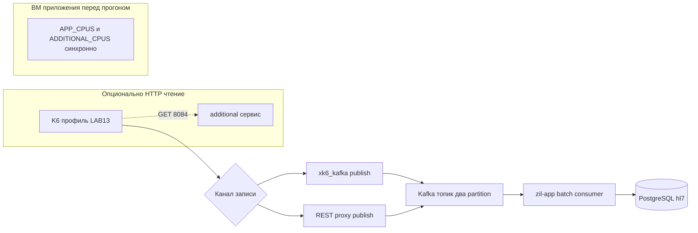

# План работ: ветка LAB13 + техническое задание и материалы

Студент: **Трюх Екатерина**. Репозиторий: **`Labs_hls`** (модуль `zil`).

Документ фиксирует **рабочий план** создания Git-ветки и подробного руководства по LAB13. Для итогового пошагового ТЗ см. файл **[LAB13_MANUAL_FULL_RU.md](LAB13_MANUAL_FULL_RU.md)** после его добавления по этому же плану.

---

## Чеклист

- [ ] Создать ветку **`docs/lab13-kafka-batch-load-testing`** от актуальной **`docs/lab12-kafka-consumer`**.
- [ ] Добавить **`zil/documentation/LAB13_MANUAL_FULL_RU.md`** с полным ТЗ: xk6 или proxy, 2 партии топика, матрица CPU × concurrency, batch listener, графики, параметры hl07 и т.д.
- [ ] Закоммитить изменения документации в новой ветке (один коммит в стиле репозитория).

Команды Git (из корня репозитория `Labs_hls`):

```bash
git fetch origin && git checkout docs/lab12-kafka-consumer && git pull --ff-only
git checkout -b docs/lab13-kafka-batch-load-testing
# после добавления MD:
git add zil/documentation/
git commit -m "docs(lab13): план нагрузки Kafka, batch concurrency, графики"
```

---

## 1. Git-ветка

- Из корня репозитория `Labs_hls`: `git fetch origin && git checkout docs/lab12-kafka-consumer && git pull --ff-only`.
- Имя ветки (**зафиксировано здесь без альтернатив**): **`docs/lab13-kafka-batch-load-testing`**.

---

## 2. Документ с подробным ТЗ

Целевой файл: **[LAB13_MANUAL_FULL_RU.md](LAB13_MANUAL_FULL_RU.md)** в этой же папке `zil/documentation/` — стиль и глубина как у [LAB12_IMPLEMENTATION_MANUAL_FULL_RU.md](LAB12_IMPLEMENTATION_MANUAL_FULL_RU.md): оглавление, таблицы «кто где», команды без выдуманных секретов, ссылки на внешние доки и на файлы проекта.

### Содержание ТЗ (развёрнуто в MD)

- **Студент / стенд (выдача):** Трюх Екатерина — SSH через **`hlssh.zil.digital`** порт **`2307`**, БД **`hl7`**, Kafka-топик учебный **`hl07`**; узлы **`kafka-1`** / **`kafka-2`**: порты **`2314`**, **`2315`**, IP **`10.60.3.12`**, **`10.60.3.13`**; узел БД: порт **`2312`**, IP **`10.60.3.9`** — упомянуть там, где нужно для проверки результатов нагрузки.
- **Цель LAB13:** нагрузочное испытание стенда **после LAB12**, при котором операции «записи» доминирующим образом идут **в Kafka**, а не мутируют основное приложение по HTTP напрямую (как в более ранних HTTP-профилях).
- **Предварительные условия:** подняты `app` (при необходимости локальный образ с LAB12+) и `additional`, [docker-compose.yml](../docker-compose.yml) с лимитами CPU; consumer на топик **`hl07`** работает (`RentalKafkaListener` по мере выполнения курсовой работы переводится на **batch**, см. раздел ниже).

### Kafka-топик и партиции (concurrency 1 vs 2)

- По методичке: **строго две партиции** топика во время экспериментов.
- Ограничение Kafka: **`PartitionCount` стандартно нельзя уменьшить** через `kafka-topics` — только увеличить. Если у **`hl07`** уже три и более партиций, указать два согласованных с преподавателем варианта:
  - отдельный топик, например **`hl07-lab13`**, **`--partitions 2`** (и синхронно `app.kafka.topic` / `KAFKA_TOPIC` на время LAB13); или  
  - пересоздание топика (с потерей исторических сообщений) по согласованию курса.
- Команды `describe` / `alter` / `create`: `kafka-topics.sh` из **`~/kafka_2.13-…`** на узле Kafka или `docker exec` в контейнер брокера.

### Перенос нагрузки «записи» в Kafka (вместо прямых HTTP мутаций в app)

- Текущий read-heavy профиль в репозитории: [load-lab8-s2s.js](../k6/load-lab8-s2s.js) — только `http.get` к **additional** (**8084**).
- По LAB13 нужен контур **JSON команд LAB12**, например **`{ "entity":"USER","operation":"POST","payload":{...} }`**: приложение **`app`** (**8083**) обрабатывает это из Kafka через `KafkaRentalCommandRouter`.

Два равноценных пути (выбор один на отчёт):

1. **`xk6-kafka`** — [xk6-kafka](https://github.com/mostafa/xk6-kafka): сборка `k6` с расширением, отправка сообщений в брокер из сценария (bootstrap, топик, сериализация).
2. **Прокси + HTTP из k6:** небольшой сервис (отдельный модуль/Java/Spring/Python/Compose): **REST POST** → **Kafka Producer**; k6 делает `http.post` на этот сервис (удобно на ВМ нагрузки **2311** рядом с k6).

Смесь нагрузки: **обязательно** — мутационные сообщения в Kafka под нагрузку на consumer; **опционально** — сохранить лёгкий GET к **8084** (параметр в духе `STATS_SHARE`/аналог), если преподаватель этого требует.

### Batch Kafka Listener (Spring Kafka)

Официальная документация: [Batch listeners](https://docs.spring.io/spring-kafka/reference/kafka/receiving-messages/listener-annotation.html#batch-listeners).

В ТЗ/реализации приложения **`zil`**:

- Отдельный или переиспользуемый `ConcurrentKafkaListenerContainerFactory` с **`setBatchListener(true)`**, метод слушателя с **`List<String>`** или **`List<ConsumerRecord<…>>`** — согласовать с конфигурацией.
- Пакетная обработка: цикл по батчу с вызовом существующего `KafkaRentalCommandRouter.dispatch`; стратегия при ошибках в середине батча (минимально: лог + продолжение или единое логирование — зафиксировать в коде при реализации).
- Атрибут **`concurrency="${app.kafka.listener.concurrency}"`** сохраняется; типичный паттерн — отдельный бин фабрики, например **`batchKafkaListenerContainerFactory`**, и `containerFactory` в **`@KafkaListener`**.

Файлы-ориентиры в коде: [RentalKafkaListener.java](../src/main/java/rental/kafka/RentalKafkaListener.java), [KafkaConsumerConfiguration.java](../src/main/java/rental/configuration/KafkaConsumerConfiguration.java), [KafkaRentalCommandRouter.java](../src/main/java/rental/kafka/KafkaRentalCommandRouter.java).

### Матрица экспериментов и CPU

| Измерение | Параметр |
|-----------|----------|
| CPU контейнеров | Одновременно **`APP_CPUS` = `ADDITIONAL_CPUS` ∈ {0.5, 1.0}** перед `docker compose up` (как в LAB10 через [run-lab10-full-matrix.sh](../k6/run-lab10-full-matrix.sh) / [lab10-hl07-docker.sh](../k6/lab10-hl07-docker.sh)). |
| Concurrency Kafka | **`KAFKA_LISTENER_CONCURRENCY` / `app.kafka.listener.concurrency` ∈ {1, 2}`** при **`PartitionCount` = 2**. |
| Итого конфигураций | **2 × 2 = 4** прогона; архивировать **JSON summary k6**, **логи `app`**; снимок БД необязательно. |

### Графики

- Переиспользовать или адаптировать [plot_lab8_reports.py](../k6/plot_lab8_reports.py) и согласованные имена JSON; ось X — конфигурация (**CPU05_conc1**, **CPU05_conc2**, **CPU10_conc1**, **CPU10_conc2**); ось Y — **p(95)** или **avg** по выбранной метрике (HTTP к прокси, или метрики k6-xk6, или иная методичкой метрика).
- В методичке задать именование файлов и выходных PNG для отчёта.

### Схема потока (оглавление эксперимента)



---

## 3. Коммит

- По готовности: один коммит с документами **`LAB13_PLAN_RU.md`** и (когда создан) **`LAB13_MANUAL_FULL_RU.md`**, сообщение например: `docs(lab13): план и руководство по нагрузочному тесту Kafka vs batch concurrency`.

---

## Что сознательно не входит в этот документ-план как «уже готово»

- Полный текст **`LAB13_MANUAL_FULL_RU.md`** помечайте отдельной задачей до тех пор, пока файл реально не создан в репозитории по разделам выше.
- Реализация batch-listener, xk6, прокси-sервиса — отдельные задачи после утверждения методичкой.
