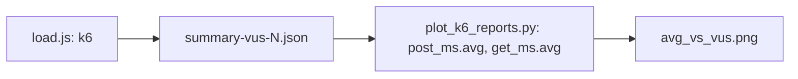

# LAB4 — нагрузка k6 (максимально просто)

**Что тут задумано:** программа **k6** много раз дергает твой сервер, как будто к нему ходят «виртуальные пользователи» (VU). Мы смотрим, растёт ли задержка ответа, когда VU больше. Для зачёта ещё нужна **картинка-график** — её строит **Python-скрипт** `plot_k6_reports.py` (комментарии в нём **по-русски**), а запуск по шагам делает `run-lab4.ps1`.

**Что лежит в `zil\k6` (скрипты + папка с отчётами):**

| Файл | Зачем |
|------|--------|
| `load.js` | Сценарий для k6: кто-то жмёт POST `/clients`, кто-то GET `/stats` |
| `run-lab4.ps1` | Запускает k6 несколько раз с разным числом VU, затем вызывает `plot_k6_reports.py` |
| `plot_k6_reports.py` | Читает `reports\summary-vus-*.json`, рисует `reports\avg_vs_vus.png` (нужен `matplotlib`) |
| `reports\` | Сюда падают json с замерами и картинка. В git картинки и json обычно не кладут. |

**Адрес API по умолчанию:** `http://localhost:8083`

**Почему комментарии в `run-lab4.ps1` на английском:** в **Windows PowerShell 5.1** кириллица внутри **двойных кавычек** в UTF-8 без BOM иногда ломает разбор файла. В самом сценарии **сообщения** для `Write-Host` тоже на латинице по той же причине. Подробные пояснения — в **`plot_k6_reports.py`** (там **русский** в комментариях и в docstring) и в **`load.js`**. В этом README — по-русски.

---

## Подробный разбор кода (как оно устроено)

### Что за эндпоинты бьёт k6

| Запрос | Назначение (в контексте лабы) |
|--------|--------------------------------|
| `POST /clients` | Создаёт нового клиента в БД. Тело — JSON с полями, как в API (`fullName`, `driverLicense`, `phone`). Каждую итерацию подставляем разные данные, чтобы не упираться в unique на одних и тех же значениях. |
| `GET /stats` | Сервис **LAB4**: отдаёт агрегаты по «горячему» кэшу и/или глобальным счётчикам (см. `StatsController` в Java). Нагрузка на чтение + работа с кэшом, отдельно от POST. |

**Зачем два сценария в одном `load.js`:** так можно одновременно нагрузить **запись** (клиенты) и **чтение** (статистика) и смотреть две кривые на графике: `post_ms` и `get_ms` (среднее время ответа в миллисекундах).

### Файл `load.js` (сценарий k6) — логика по шагам

1. **Импорты** — `http` (запросы), `check` + `sleep` (проверки и паузы), `Trend` (свои метрики).
2. **`timePost` / `timeGet`** — объекты `Trend('post_ms')` и `Trend('get_ms')`. В каждом ответе мы делаем `timePost.add(длительность)` / `timeGet.add(...)`. В **итоговом** json-summary эти тренды превращаются в `metrics.post_ms`, `metrics.get_ms` с полем `avg` — его потом читает Python для графика.
3. **Переменные окружения k6** (`__ENV`):
   - `BASE_URL` — куда стучимся (по умолчанию `http://localhost:8083`);
   - `POST_SHARE` — **доля** от `TARGET_VUS`, уходящая на сценарий с POST. Пример: `TARGET_VUS=10`, `POST_SHARE=0.5` → в POST примерно половина VU, в GET — остаток (с округлением `floor` для POST);
   - `TARGET_VUS` — целевое число VU; скрипт `run-lab4.ps1` подставляет разные значения (10, 20, …) для **серии** прогонов.
4. **`vuForPost` и `vuForGet`** — сколько VU максимум в **сценарии** `only_post` и сколько в `only_get`. Сумма = `TARGET_VU` (для стандартных целых и доли 0.5).
5. **Функция `upDown(maxVu)`** — три стадии: разгон, полка, сход к нулю. Это типичный `ramping-vus`: плавно меняем количество VU, а не «врубили 160 с нуля сразу».
6. **`export const options`** — у k6 **два параллельных** `scenarios` с разными `exec`:
   - `only_post` → функция `doPost`;
   - `only_get` → `doGet`.
   У каждого свой `stages: upDown(vuForPost)` или `upDown(vuForGet)`.
7. **`thresholds`** — если доля **неуспешных** HTTP (`http_req_failed`) ≥ 15%, k6 завершится с **ошибкой** (код не 0), чтобы это было видно в скрипте.
8. **`doPost`**: собирает JSON с уникальным `driverLicense` (через `randomUuid()`), `http.post` на `/clients`, пишет длительность в `timePost`, `check` на статус 200, `sleep(0.05)`.
9. **`doGet`**: `http.get` на `/stats`, длительность в `timeGet`, проверка 200, пауза.

**Важно:** имя кастомной метрики (`post_ms` / `get_ms`) **должно совпадать** с тем, что читает Python в `summary-vus-*.json` — иначе график не построится.

### Файл `run-lab4.ps1` (обёртка) — логика по шагам

1. Папка скрипта → `$here`; рядом создаётся/используется `reports\`.
2. **Очистка** старых `summary-vus-*.json` и `avg_vs_vus.png` перед новой серией, **если** не задано `NO_CLEAN=1` и не включён `PLOT_ONLY=1` (для PLOT_ONLY старые json нужны).
3. **Цикл** по списку `VUS_LIST` (или 10, 20, 40, 80, 160): выставляется `TARGET_VUS`, вызывается `k6 run --summary-export reports\summary-vus-НОМЕР.json load.js`. Так для каждого уровня нагрузки получается **отдельный** json.
4. Если **`NO_PLOT=1`** — после k6 **выходим**, график не рисуем.
5. Ищем **Python** (`py` / `python` / `python3`) и запускаем **рядом лежащий** `plot_k6_reports.py` (переменная окружения `K6_REPORTS_DIR` указывает на `reports`). Скрипт: читает `summary-vus-число.json`, берёт **avg** из `metrics.post_ms` и `metrics.get_ms`, строит `reports\avg_vs_vus.png`. Вручную, без `run-lab4.ps1`: из папки `k6` можно `py plot_k6_reports.py` (если `K6_REPORTS_DIR` не задан — используется подпапка `reports` рядом с `.py`).

**Режим `PLOT_ONLY=1`:** k6 **не** запускается; только Python читает уже существующие json (удобно, если k6 отработал, а `matplotlib` поставили позже).

**Переменные, которые k6 увидит из PowerShell:** для процесса k6 `run-lab4.ps1` выставляет `$env:BASE_URL`, `$env:POST_SHARE`, `$env:TARGET_VUS` — в `load.js` они читаются как `__ENV.BASE_URL` и т.д. (k6 кладёт `TARGET_VUS` в то же `__ENV`).

### Файл `plot_k6_reports.py` (график) — кратко

- В начале файла — **docstring** и комментарии **по-русски** (как устроен разбор json).
- `K6_REPORTS_DIR` — папка с `summary-vus-*.json` (её выставляет `run-lab4.ps1`). Если запускаешь скрипт вручную из `k6` без env — подставится `reports` рядом с `.py`.
- Функция `get_avg` вытаскивает среднее по полям k6 summary (под разные форматы).
- `matplotlib` с бэкендом `Agg` пишет png без окна.

### Схема потока данных (от прогона до картинки)



---

## Как запустить (если совсем с нуля)

Сделай **по порядку**, не перескакивай.

1. **Открой PowerShell** (Пуск → набери `PowerShell` → Enter).

2. **Перейди в папку с лабой.** Подставь **свой** путь к репозиторию, если он не такой:
   ```powershell
   cd C:\Users\1\Desktop\neurohelp\first_laba\zil
   ```

3. **Подними сервер** (база + приложение в Docker). Дождись, пока команда закончится без красных ошибок:
   ```powershell
   docker compose up --build -d
   ```
   Если Docker не установлен или не запущен — сначала поставь **Docker Desktop** и включи его.

4. **Перейди в папку k6:**
   ```powershell
   cd k6
   ```

5. **Поставь то, чего нет** (делается один раз на компьютер):
   - k6: `winget install grafana.k6` — потом **закрой и снова открой** PowerShell и снова `cd` в папку `k6`.
   - график: `py -m pip install matplotlib` (или `python -m pip install matplotlib`).

6. **Запусти нагрузку и график одной командой:**
   ```powershell
   .\run-lab4.ps1
   ```
   Если пишет **«выполнение сценариев отключено»** / `PSSecurityException` — **один раз** в PowerShell (админ **не** нужен):
   ```powershell
   Set-ExecutionPolicy -Scope CurrentUser -ExecutionPolicy RemoteSigned
   ```
   Согласись на `Y` если спросит. Потом снова `.\run-lab4.ps1`.  
   **Временный обход** без смены политики:  
   `powershell -ExecutionPolicy Bypass -File .\run-lab4.ps1`

**Где смотреть результат:** папка `zil\k6\reports\` — там появятся файлы `summary-vus-….json` и картинка **`avg_vs_vus.png`**.

**Если что-то пошло не так:** на порту **8083** не должно быть двух программ сразу (например Docker **и** запуск из IntelliJ). Останови лишнее.

**Если PowerShell пишет про «лишние/лишние `}`» или в ошибке вместо русских букв кракозябры** — в старом **Windows PowerShell 5.1** скрипты **UTF-8 без BOM** с кириллицей внутри кавычек иногда ломают разбор. В `run-lab4.ps1` строки сделаны **латиницей** специально под это; не переключай файл обратно на русский в теле `.ps1` без сохранения **UTF-8 с BOM** (в VS Code: статусбар → кодировка → «Save with Encoding» → UTF-8 with BOM).

---

## Шаг 1. Поставь софт (один раз)

1. **k6**  
   В PowerShell можно так: `winget install grafana.k6`  
   Либо скачай установщик с сайта k6. После установки **закрой и снова открой** терминал.  
   Проверка: `k6 version` — что-то должно напечатать.

2. **Python** (если ещё нет)  
   С официального сайта python.org, галочка «add to PATH».  
   Проверка: `py --version` или `python --version`

3. **Библиотека для рисования графика**  
   В PowerShell:  
   `py -m pip install matplotlib`  
   (если у тебя вызывается `python`, то `python -m pip install matplotlib`)

---

## Шаг 2. Запусти сервис (база + приложение)

В папке `zil` (там, где `docker-compose.yml`):

```powershell
docker compose up --build -d
```

Проверь, что открывается, например: `http://localhost:8083/cars` в браузере.

**Важно:** на порту 8083 не должны одновременно сидеть и Docker-приложение, и тот же сервер из IntelliJ. Один запуск — один процесс.

---

## Шаг 3. Один прогон k6 (проверить, что вообще работает)

```powershell
cd zil\k6
k6 run load.js
```

Если куча ошибок `connection refused` — сервис на 8083 не поднят.

Записать отчёт в файл (число VU — 40, настраивается переменной):

```powershell
$env:TARGET_VUS = "40"
k6 run --summary-export reports\summary-vus-40.json load.js
```

---

## Шаг 4. Всё сразу: много прогонов + картинка

Тот же `zil\k6`:

```powershell
.\run-lab4.ps1
```

Скрипт по очереди гоняет k6 (по умолчанию VU: 10, 20, 40, 80, 160), кладёт json в `reports\`, в конце рисует **`reports\avg_vs_vus.png`**.

**Если картинка не нужна** (только json):  
`$env:NO_PLOT = "1"; .\run-lab4.ps1`

**Свой набор VU** (через пробел):  
`$env:VUS_LIST = "5 10 20 40"; .\run-lab4.ps1`

**Не чистить старые отчёты в `reports` перед прогоном:**  
`$env:NO_CLEAN = "1"; .\run-lab4.ps1`

**Только пересобрать картинку** из уже лежащих `reports\summary-vus-*.json` (после `py -m pip install matplotlib`, без повторного долгого k6):  
`$env:PLOT_ONLY = "1"; .\run-lab4.ps1`

**Другой адрес API:**  
`$env:BASE_URL = "http://127.0.0.1:8083"; .\run-lab4.ps1`

**Доля нагрузки на POST (остальное на GET), от 0 до 1, по умолчанию 0.5 — пополам:**  
`$env:POST_SHARE = "0.5"; .\run-lab4.ps1`

---

## Частые вопросы

| Симптом | Что сделать |
|--------|-------------|
| `k6` не распознано | Поставь k6, перезапусти PowerShell, проверь `k6 version` |
| нет `matplotlib` | `py -m pip install matplotlib` |
| график не появился | Смотри сообщение в консоли; без Python скрипт только json сделает и предупредит |
| порт 8083 занят | Останови лишний процесс на этом порту |

Подробный план по смыслу задания: `zil\documentation\LAB4_PLAN.md`
